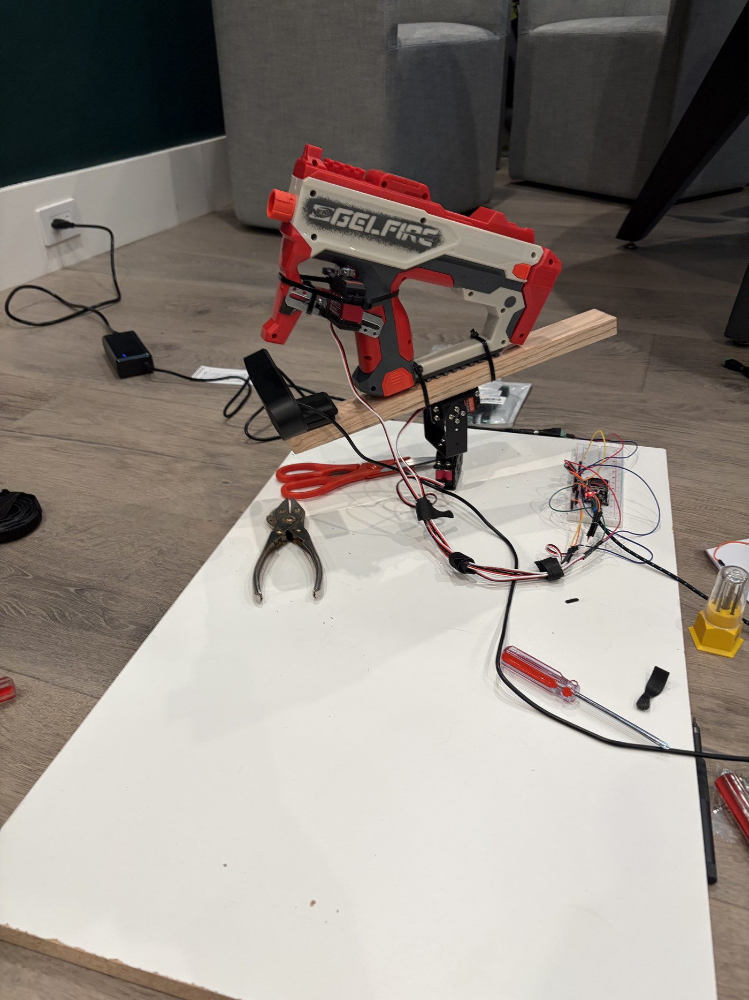

# CV Sentry Turret

A camera on a motorized mount finds a person, recognizes their face, aims a gel blaster by driving the motors in real time, and fires the moment it locks on. Because the camera rides on the gun, "target centered in the frame" means "gun aimed at the target."

I built the whole thing from scratch: the Python vision and aiming brain, the microcontroller firmware, and the physical rig.

## Demo

<!-- ADD THE VIDEO: open this file on github.com, click the pencil (Edit), then DRAG your video file onto the line below. GitHub uploads it and turns it into a player. Delete this comment and the "video coming" line after. -->
_Demo video coming._



## What it does

- Finds and follows a person in real time from one webcam, even when they turn or face sideways.
- Recognizes a *specific* person, and either targets only them, or guards against everyone *except* them.
- Aims by driving the motors through a feedback loop, leading a moving target and correcting for the gel arc.
- Fires automatically once it has held its aim, with both a software safety and a physical arm switch required.

## How it works (the full loop)

The camera rides on the gun and plugs into a laptop by USB. **The laptop is the brain, it runs all of the vision and aiming. The ESP32 chip is just the muscle, it only turns the motors when told.** The loop below runs about 15 times a second:

1. **Camera → laptop.** The webcam sends the laptop a picture.
2. **Find faces.** A small model (YuNet) boxes every face in the picture.
3. **Recognize who.** A second model (SFace) turns each face into a 128-number fingerprint and matches it to saved photos, so it knows who is who and rejects look-alikes.
4. **Aim.** It picks the target, sees where they are in the frame, and works out how far to turn the gun to center them, leading a moving target and aiming a little high for the gel arc. Because the camera is on the gun, "centered in the frame" *is* "aimed."
5. **Laptop → ESP32.** The laptop sends the chip one short line, like `P094 T081` (pan 94, tilt 81 degrees), plus `FIRE` when it should shoot.
6. **ESP32 → motors.** The chip turns the three servos to those angles (smoothly, so it never jerks), and pulls the trigger servo only if the line says FIRE *and* the physical arm switch is on. No camera, no AI, no decisions, it just moves motors.
7. The gun moves, the camera (on it) sees a new view, and it repeats.

Unplug the laptop and the turret goes blind and frozen: all the intelligence lives there, and the chip is a few dollars of muscle.

```
 camera ─► laptop:  find faces ─► recognize who ─► aim math ─► fire?
   ▲                                                             │
   │                                        "P094 T081 [FIRE]" over USB
   │                                                             ▼
   └──────── gun moves ◄──── ESP32 turns the servos ◄───────────┘
```

## Engineering highlights

The wiring was the easy part. Making the feedback loop behave was the real work. A few problems I had to find and fix:

- **Camera-on-gun aiming.** A camera fixed to the room and a camera riding the gun need *opposite* aiming math. My first version quietly settled at the halfway point and reported "locked" while it was actually off target. I rewrote it to drive the target's offset from frame-center to zero.
- **"Stuck pointing down."** It would dive to its lowest angle and freeze. Up close, the point it aims at (a bit below the face) fell off the bottom of the frame, so it chased an off-screen point straight into the motor's end stop. Fixed by capping how far below the face it aims.
- **The nodding loop.** On a low camera, one blurry frame made it guess where the target went and fling the gun to a corner, then swing back, over and over. Fixed by holding still through a brief blip instead of guessing.
- **Recognizing me in the real world.** Match scores were shaky at steep angles until I added ~60 photos taken from the actual angles it sees, and learned that lighting matters more than any setting.

Every fix is a commented, tested change. `--selftest` runs the logic checks with no camera or hardware.

## Get it running (no hardware needed)

You can run the full brain, detection, recognition, and the aiming math, on any Mac or PC with a webcam. Nothing physical is required to see it work.

**You need:** Python 3.9 or newer, a webcam, and git.

**1. Get the code**
```bash
git clone https://github.com/rygit1/sentry-turret.git
cd sentry-turret
```

**2. Set up Python and install the requirements**
```bash
python3 -m venv .venv
source .venv/bin/activate
pip install -r requirements.txt
```

**3. Download the two face models.** These are NOT in the repo, and it will not run without both of them:
```bash
mkdir -p models
# face detector (YuNet)
curl -L -o models/face_detection_yunet_2023mar.onnx \
  https://github.com/opencv/opencv_zoo/raw/main/models/face_detection_yunet/face_detection_yunet_2023mar.onnx
# face recognizer (SFace)
curl -L -o models/face_recognition_sface_2021dec.onnx \
  https://github.com/opencv/opencv_zoo/raw/main/models/face_recognition_sface/face_recognition_sface_2021dec.onnx
```

**4. Teach it your face** so recognition knows who you are:
```bash
python enroll_capture.py --camera 0
```
A window opens and snaps a couple dozen photos of you. Do it in decent light, and turn your head a bit so it sees a few angles.

**5. Run it**
```bash
python turret_brain.py --lock-me
```
A webcam window opens. A **green** box and crosshair lock onto **you**; anyone else gets a **red** box and is ignored. The crosshair turns **yellow** and reads **LOCKED** when it is on target. Press **SPACE** to arm, **Q** to quit. With no hardware attached it just prints the aim commands it *would* send.

> First run, your Mac will ask for camera permission for your terminal. If the window never opens: System Settings > Privacy & Security > Camera > turn on your terminal app, then run it again.

Useful options: `--target-others` (guard mode: target everyone except you) · `--selftest` (logic checks, no camera) · `--detector person` (track whole bodies, needs `pip install ultralytics`).

## Run the real turret (with hardware)

1. Install the Arduino IDE, add ESP32 board support, and the **ESP32Servo** library.
2. Open `firmware/turret/turret.ino`, pick board "ESP32 Dev Module" and your port, and Upload.
3. Find the port: `ls /dev/cu.*` (it looks like `/dev/cu.usbserial-XXXX`).
4. Run the brain pointed at that port:
```bash
python turret_brain.py --serial /dev/cu.usbserial-XXXX --camera 0 --lock-me
```

The computer sends one line per frame: `P094 T081` (pan 94, tilt 81 degrees), plus `FIRE` when it shoots. Motor pins: pan 13, tilt 14, trigger 27, arm switch 33. Full wiring and step-by-step assembly are in **[BUILD.md](BUILD.md)** and **[FINISH-GUIDE.md](FINISH-GUIDE.md)**.

## Built with

Python, OpenCV (YuNet + SFace), optional YOLO11, and a hand-written aiming and fire-control loop. ESP32 + Arduino firmware. Three servo motors on a 2-axis mount, a webcam, and a Nerf gel blaster on a separate 5V supply.

## Safety

Gel beads only. Eye protection whenever it is armed. Body-only targets, never a face. Firing needs *both* a software arm (SPACE) and a physical switch, and it starts disarmed. Never point it at anyone who has not agreed to be a target.
